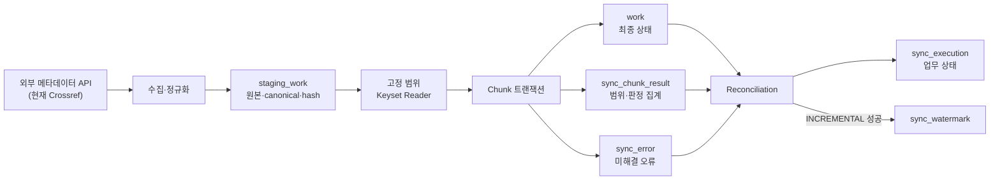
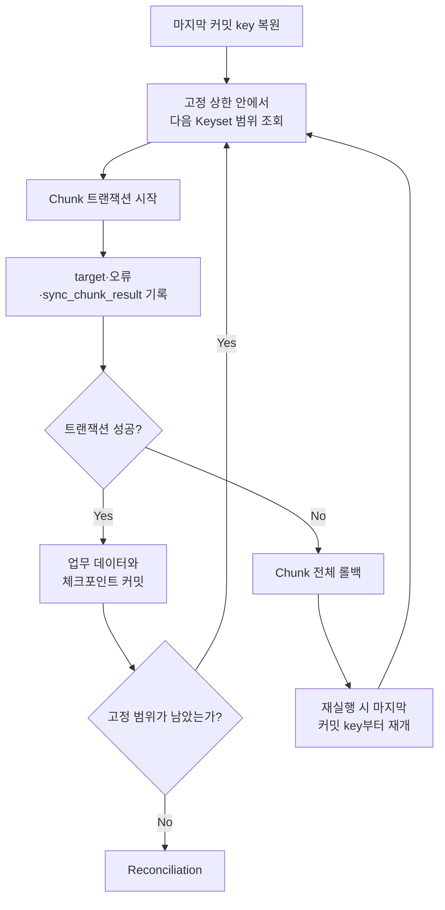

# Open Metadata Sync

외부 학술 메타데이터를 대량으로 수집해 DB와 동기화하고 실패 후 재시작과 데이터 정합성까지 검증한 Spring Batch 프로젝트입니다.

> 필요할 때 운영자가 직접 실행하는 배치를 전제로 합니다. 정기 스케줄 실행은 설계 범위에서 제외했으며 애플리케이션 내부 스케줄러와 HTTP/Admin 실행 API도 제공하지 않습니다.

## 목차

- [1. 프로젝트 소개](#1-프로젝트-소개)
- [2. 주요 검증 결과](#2-주요-검증-결과)
- [3. 문제 정의와 설계 목표](#3-문제-정의와-설계-목표)
- [4. 전체 아키텍처](#4-전체-아키텍처)
- [5. 핵심 설계 판단](#5-핵심-설계-판단)
- [6. 실행 모드와 처리 결과](#6-실행-모드와-처리-결과)
- [7. 로컬 실행](#7-로컬-실행)
- [8. Jenkins 운영](#8-jenkins-운영)
- [9. 외부 시연 인프라](#9-외부-시연-인프라)
- [10. 검증 근거](#10-검증-근거)
- [11. 기술 스택과 프로젝트 구조](#11-기술-스택과-프로젝트-구조)
- [12. 검증 범위와 제한](#12-검증-범위와-제한)

## 1. 프로젝트 소개

### 개발 배경

외부 API에서 많은 데이터를 가져와 DB에 반영할 때는 배치가 `COMPLETED`로 끝났다는 사실만으로 결과를 신뢰하기 어렵습니다. 실패 후 어디서 다시 시작하는지, 같은 데이터를 다시 처리해도 불필요한 변경이 없는지, 수집 건수와 최종 결과가 일치하는지까지 확인해야 합니다.

이 프로젝트는 다음 질문에 답하는 것을 목표로 했습니다.

- 처리 범위가 실행 중 바뀌어도 누락이나 중복 없이 끝낼 수 있는가?
- 청크 실패 후 마지막 커밋 지점부터 안전하게 재시작할 수 있는가?
- 신규, 변경, 동일, 충돌 데이터를 구분하고 모든 입력을 결과로 설명할 수 있는가?
- 애플리케이션 결과와 Jenkins 상태를 일관된 운영 신호로 전달할 수 있는가?

### 프로젝트 범위

| 구분 | 현재 상태 |
|---|---|
| 실제 메타데이터 수집·동기화·검증 | 완료 |
| 합성 데이터 벤치마크와 재시작 검증 | 완료 |
| 오류 항목 재처리와 이력 연결 | 완료 |
| Jenkins 수동 실행과 증빙 보존 | 완료 |
| 정기 스케줄 실행 | 고려하지 않음 — 프로젝트 범위 외 |
| 외부 시연 인프라 | **TBD — 설계 초안 단계, 구현·검증 전** |

실제 수집 어댑터는 Crossref REST API를 사용합니다. 다만 핵심 설계는 특정 제공자 자체보다 대량 데이터의 고정 범위 처리, 재시작, 결과 분류와 정합성 검증에 초점을 둡니다.

## 2. 주요 검증 결과

| 검증 항목 | 결과 | 확인한 내용 |
|---|---|---|
| 자동화 테스트 | **128개 통과, 실패·오류·스킵 0건** | 배치 계약, 수집 안전장치, Keyset 조회와 청크 처리, 정합성 검증, 재처리, Jenkins 계약 |
| 실제 API 연동 | **100,000건 수집·처리, 100개 청크, 롤백 0건** | 수집·스테이징·처리 결과 100,000건 일치, 미해결 충돌·검증 오류 0건 |
| 합성 100만 initial | **1,000,000건 반영, Processing PASS** | 스테이징과 대상 테이블의 체크섬 일치, 1,000,000건 INSERT |
| 합성 100만 no-op | **1,000,000건 판정, Processing PASS** | 스테이징과 대상 테이블의 체크섬 일치, 대상 테이블 INSERT/UPDATE 0건 |
| 10만 재시작 PREFLIGHT | **initial/no-op 모두 PASS** | 의도적 첫 실행 실패 후 이미 커밋한 범위를 건너뛰고 99,000건부터 재개 |
| 오류 재처리 스모크 테스트 | **Jenkins SUCCESS** | 원본 오류 `OPEN → RESOLVED`, `replay_count 0 → 1`, 재처리 대상 1건 no-op, 대상 테이블 불변 |

> 각 결과가 확인하는 범위는 다릅니다. 합성 100만 결과는 데이터 처리 계층의 확장성을, 실제 10만 결과는 외부 API를 포함한 전체 흐름을 확인합니다. PREFLIGHT와 오류 재처리는 서로 다른 실패 복구 계약을 검증합니다.

## 3. 문제 정의와 설계 목표

| 문제 | 설계 목표 |
|---|---|
| Offset 조회 중 데이터가 추가되거나 순서가 달라지면 누락·중복 가능 | 실행별 처리 상한을 고정하고 단조 증가 키로 조회 |
| 청크 중간 실패 시 처리 위치와 DB 반영 결과가 어긋날 수 있음 | 업무 데이터, 청크 결과, Spring Batch 체크포인트를 같은 커밋 경계로 관리 |
| 배치 성공 상태만으로 모든 입력이 설명됐는지 알 수 없음 | 고정 범위 건수, 청크 처리 범위, 결과 합계, 대상 데이터와 체크섬을 대조 |
| 동일 데이터를 다시 처리할 때 불필요한 DML이 발생할 수 있음 | 정규화된 콘텐츠 해시와 원본 갱신 시각으로 `NO_OP`을 분리 |
| 오류 재처리가 원본 오류와 분리되면 이력을 추적하기 어려움 | 원본 오류 key를 재처리 스테이징에 연결하고 성공 후 원본 상태를 해소 |
| 프로세스 종료와 Jenkins 결과가 다르게 해석될 수 있음 | 결과 파일과 종료 코드를 검증해 Jenkins 상태로 명확하게 변환 |

## 4. 전체 아키텍처



| 구성 요소 | 책임 |
|---|---|
| `sync_execution`, `sync_window` | 요청 계약과 수집 범위·진행 상태 고정 |
| `staging_work` | 외부 원본과 정규화 결과를 실행 단위로 보존 |
| `JpaKeysetWorkReader` | 마지막 커밋 key 이후부터 고정 상한까지 조회 |
| `ChunkAwareJpaWorkWriter` | 대상 데이터 반영, 결과 분류, 오류와 청크 집계를 함께 기록 |
| `JpaExecutionVerifier` | 입력 범위와 처리 결과, 대상 데이터, 체크섬, 열린 오류 대조 |
| `sync_watermark` | 검증을 통과한 증분 실행만 다음 시작점으로 반영 |

## 5. 핵심 설계 판단

### 5.1 외부 API 페이지의 진행 여부를 데이터로 판단하기

외부 API의 cursor는 다음 조회 위치를 가리키지만, 페이지마다 문자열이 달라진다는 보장은 없습니다. 실제 10만 건 수집에서도 같은 cursor가 유지된 채 서로 다른 다음 페이지가 반환됐습니다. 따라서 cursor 값의 변화만으로 진행 여부를 판단하지 않고, 직전 전체 페이지의 응답 내용과 새로 적재된 데이터가 있는지를 함께 확인합니다.

동일한 전체 페이지가 연속으로 반환되면 중복 저장하지 않고 한 차례 더 요청합니다. 이후에도 같은 응답이 반복되면 무진전 상태로 판단해 실행을 실패시키며, 전체 요청 횟수 상한과 비어 있는 cursor 검증도 함께 적용합니다. 이를 통해 정상적으로 유지되는 cursor는 허용하면서도 중복 적재와 끝나지 않는 수집을 막습니다.

### 5.2 실행 범위를 먼저 고정하고 Keyset으로 읽기

수집이 끝나면 해당 실행의 `expected_count`와 `staging_upper_bound`를 고정합니다. Reader는 `staging_key > lastCommittedKey AND staging_key <= frozenUpperBound` 조건으로 조회합니다. 처리 도중 새 스테이징 데이터가 추가돼도 현재 실행 범위에는 섞이지 않습니다.

재시작할 때는 Offset을 다시 계산하지 않고 마지막 커밋 key만 사용합니다. 따라서 전체 데이터 건수가 달라져도 재시작 위치는 바뀌지 않습니다. 동일한 `requestId`로 업무 파라미터나 `syncContractHash`를 바꾸면 재시작을 거부해 서로 다른 실행 계약이 섞이는 것도 막습니다.

### 5.3 청크 트랜잭션과 재시작 경계 맞추기



Writer는 대상 데이터 변경과 `sync_chunk_result`를 같은 청크 안에서 기록합니다. Spring Batch의 ExecutionContext 체크포인트도 같은 커밋 경계에서 전진합니다. 실패한 청크의 일부 결과만 남는 일을 막고 마지막 성공 지점부터 다시 읽을 수 있습니다.

### 5.4 결과를 분류하고 전체 입력을 대사하기

스테이징의 각 데이터는 다음 결과 중 하나로 분류됩니다.

| 결과 | 의미 | 대상 테이블 DML |
|---|---|---|
| `INSERTED` | 대상 테이블에 없는 신규 데이터 | INSERT |
| `UPDATED` | 더 최신이고 내용이 달라진 데이터 | UPDATE |
| `INDEX_ADVANCED` | 내용은 같고 원본 갱신 시각만 전진한 데이터 | UPDATE |
| `NO_OP` | 대상 데이터와 시각·내용이 같거나 동일한 최신 항목이 중복된 데이터 | 없음 |
| `SUPERSEDED` | 같은 식별자의 더 오래된 데이터 | 없음 |
| `CONFLICT` | 같은 시각에 서로 다른 정규화 결과가 존재 | `sync_error` 기록 |

마지막 검증에서는 단순 합계뿐 아니라 다음 조건을 확인합니다.

- 고정된 예상 건수 = 스테이징 대상 건수 = 청크 결과 합계
- 청크 순서와 key 범위에 누락·중첩이 없음
- 오류가 아닌 식별자는 대상 테이블에 존재함
- 스테이징의 최신 항목과 대상 데이터의 시각·콘텐츠 해시가 일치함
- 열린 오류 건수와 청크의 충돌·검증 오류 건수가 일치함

`INCREMENTAL` watermark는 이 검증이 끝난 뒤에만 전진합니다. `REPLAY_ERRORS`가 정상 완료되면 재처리 스테이징에 연결된 원본 오류만 `RESOLVED`로 바꿉니다.

### 5.5 애플리케이션 결과와 Jenkins 상태 연결하기

애플리케이션은 종료 코드와 `batch.outcome-file`에 같은 결과를 남깁니다. Jenkins는 현재 요청의 code, request ID, job, mode가 결과 파일과 정확히 일치하는지 확인한 뒤 빌드 상태를 결정합니다.

실행 직전에는 현재 요청이 사용할 결과 파일 하나만 제거합니다. 이전 실행의 파일이나 다른 요청의 결과를 현재 빌드의 성공으로 잘못 판단하지 않기 위해서입니다.

## 6. 실행 모드와 처리 결과

### 실행 모드

| 모드 | 목적 | 범위 고정 기준 |
|---|---|---|
| `BACKFILL` | 생성일 범위의 과거 데이터 수집 | `createdFrom`, `createdUntil`, `maxItems` |
| `INCREMENTAL` | 마지막 성공 시점 이후 데이터 수집 | watermark부터 실행 시작 시각까지의 UTC window |
| `REPLAY_ERRORS` | 특정 실행의 열린 오류만 재처리 | 시작 시점의 원본 `OPEN` 오류 상한 |
| `BENCHMARK` | 외부 API를 제외한 합성 데이터 처리 검증 | `rowCount`, `seed`, `generatorVersion`, `scenario` |

### 프로세스 결과

| 종료 코드 | 애플리케이션 결과 | Jenkins 결과 | 의미 |
|---:|---|---|---|
| `0` | `SUCCESS` | `SUCCESS` | 처리와 검증 정상 완료 |
| `2` | `COMPLETED_WITH_ERRORS` | `UNSTABLE` | 허용된 업무 오류를 포함해 완료 |
| `1` | `FAILED` | `FAILURE` | 기술 오류, 충돌, 검증 또는 결과 파일 기록 실패 |
| `3` | `ALREADY_COMPLETED` | `NOT_BUILT` | 같은 식별 파라미터의 실행이 이미 완료됨 |

구조화 로그의 `BATCH_JOB_START`, `BATCH_STEP_END`, `BATCH_JOB_END`, `BATCH_*_FAILURE`는 진행 상황과 오류를 관찰하기 위한 신호입니다. 재시작 위치는 로그가 아니라 Spring Batch 메타데이터와 `sync_chunk_result`를 기준으로 판단합니다.

## 7. 로컬 실행

### 요구 환경

- Java 21
- Docker / Docker Compose
- MySQL 8.4

### DB와 애플리케이션 준비

```bash
docker compose up -d mysql

export DB_USERNAME='open_metadata'
export DB_PASSWORD='open_metadata'

./gradlew bootJar
```

DB 인증 정보는 마스킹할 수 있는 환경 변수로 전달하며 Job Parameter나 증빙 파일에는 넣지 않습니다.

### 실제 BACKFILL 실행 예시

```bash
java -jar build/libs/open-metadata-sync-0.0.1-SNAPSHOT.jar \
  --spring.batch.job.enabled=true \
  --spring.batch.job.name=crossrefSyncJob \
  --spring.profiles.active=actual \
  --batch.outcome-file=build/manual/crossref-outcome.properties \
  requestId=manual-backfill-001,java.lang.String,true \
  mode=BACKFILL,java.lang.String,true \
  createdFrom=2026-08-01,java.time.LocalDate,true \
  createdUntil=2026-08-02,java.time.LocalDate,true \
  maxItems=1000,java.lang.Long,true \
  chunkSize=1000,java.lang.Long,false \
  hibernateBatchSize=1000,java.lang.Long,false
```

### 합성 BENCHMARK 실행 예시

```bash
java -jar build/libs/open-metadata-sync-0.0.1-SNAPSHOT.jar \
  --spring.batch.job.enabled=true \
  --spring.batch.job.name=dataPlaneBenchmarkJob \
  --spring.profiles.active=benchmark-preflight \
  --batch.outcome-file=build/manual/benchmark-outcome.properties \
  requestId=manual-benchmark-001,java.lang.String,true \
  mode=BENCHMARK,java.lang.String,true \
  rowCount=100000,java.lang.Long,true \
  seed=20260808,java.lang.Long,true \
  generatorVersion=v1,java.lang.String,true \
  scenario=initial,java.lang.String,true \
  chunkSize=1000,java.lang.Long,false \
  hibernateBatchSize=1000,java.lang.Long,false \
  evidenceDirectory=benchmark-evidence,java.lang.String,false \
  failFirstExecution=0,java.lang.Long,false
```

애플리케이션 launcher는 현재 빌드의 `syncContractHash`를 식별 파라미터로 자동 추가합니다. 요청·실행 모드·업무 계약은 식별 파라미터입니다. 청크 크기와 Hibernate batch 크기 같은 튜닝 값은 비식별 파라미터로 분리합니다.

## 8. Jenkins 운영

Jenkins에서는 두 개의 Pipeline을 운영자가 필요할 때 직접 실행합니다. 정기 실행 트리거와 cron, SCM polling은 설정하지 않았습니다.

| Pipeline | 역할 |
|---|---|
| `crossref` | 실제 `BACKFILL`, `INCREMENTAL`, `REPLAY_ERRORS` 실행 |
| `benchmark` | 합성 `initial`, `no-op` 처리와 PREFLIGHT/MAIN 증빙 생성 |

### 필수 Jenkins 설정

- 두 Job을 하나의 `open-metadata-sync` Folder 아래에 배치
- Jenkins JDK 도구 이름을 `jdk21`로 등록
- Lockable Resources에 `open-metadata-sync-data-plane` 등록
- Folder credential store에 `open-metadata-sync-db` username/password credential 등록
- Folder Properties에 `DB_HOST`, `DB_PORT` 설정

두 Pipeline은 DB 설정을 검증한 뒤 대기하지 않는 공유 lock을 획득합니다. lock을 얻지 못하면 애플리케이션을 실행하지 않고 `NOT_BUILT`로 종료합니다. lock은 애플리케이션 실행부터 결과 검증, 증빙 생성과 산출물 보존까지 보호합니다.

### 벤치마크 Gate

| `BENCHMARK_GATE` | Spring profile | Rows | 목적 |
|---|---|---:|---|
| `PREFLIGHT` | `benchmark-preflight` | `100000` | 재시작·heap retention·persistence 자격 확인 |
| `MAIN` | `benchmark` | `1000000` | 100만 데이터 처리 결과 확인 |

`WORKLOAD_SCENARIO`는 `initial` 또는 `no-op`을 선택합니다. `MAIN`은 동일 계약으로 완료된 10만 initial/no-op PREFLIGHT 증빙 쌍을 요구합니다. benchmark JVM에는 `-Xms128m -Xmx256m`을 고정해 실행 간 메모리 조건을 맞춥니다.

`Processing result PASS`는 시나리오별 처리 결과와 데이터 대사, 체크섬, 행 무결성을 모두 통과했다는 뜻입니다. PREFLIGHT 자격 미충족은 처리 실패와 구분해 Jenkins `UNSTABLE`로 표시합니다. Pipeline은 결과 파일과 허용된 JSON/Markdown만 보존합니다. 로그, 비밀 정보, 알 수 없는 확장자나 광범위한 workspace glob은 산출물에 포함하지 않습니다.

Pipeline은 schema, DB, volume, branch를 자동으로 정리하지 않습니다. 데이터 보존과 정리는 실행·검증과 분리해 별도 승인 대상으로 둡니다.

## 9. 외부 시연 인프라

> **TBD — 아직 구현하거나 검증하지 않았습니다.**

외부 시연 인프라가 완성되면 다음 내용을 이 절에 추가합니다.

- 외부 접근 경로와 애플리케이션 실행 환경 구성도
- 인증·접근 제어와 secret 관리 방식
- 시연용 실행 절차와 관찰 가능한 결과
- 외부 환경에서 다시 수행한 검증 결과와 제한 사항

애플리케이션 내부 처리 구성도와 외부 시연 인프라 구성도는 책임이 다르므로 별도 다이어그램으로 유지합니다.

## 10. 검증 근거

### 증빙의 책임 경계

| 증빙 | 책임 |
|---|---|
| Spring Batch 메타데이터, `sync_chunk_result` | 실행과 재시작의 기준이 되는 영속 원본 |
| DB 대사 결과 | 업무 완료와 데이터 정합성 판단 |
| 구조화 로그 | 진행·오류 관찰을 위한 일시적 신호 |
| 결과 파일, Jenkins 상태·산출물 | 실행 결과의 기계 판독 가능한 요약 |

상세한 경계는 [증빙 책임 범위](docs/evidence/README.md)에서 확인할 수 있습니다.

### 저장소에서 확인할 수 있는 근거

- [최종 실제 10만 전체 흐름 대사 기록](docs/superpowers/plans/2026-08-09-crossref-stable-cursor.md#final-reconciliation--2026-08-09)
- [합성 10만·100만 벤치마크 증빙](benchmark-evidence/m1-358b6ce/README.md)
- [Jenkins Pipeline 계약 테스트](src/test/java/com/heojungseok/openmetadatasync/jenkins/JenkinsPipelineContractTest.java)
- [통합 검증 테스트](src/test/java/com/heojungseok/openmetadatasync/batch/OpenMetadataSyncJobIntegrationTest.java)

| 실행 증빙 | Jenkins build | 실행 SHA | 결과 |
|---|---:|---|---|
| 합성 100만 initial / no-op | `benchmark #14 / #15` | `8d6dd85` | `SUCCESS / SUCCESS` |
| 10만 restart PREFLIGHT initial / no-op | `benchmark #19 / #21` | `7350aa1` | `SUCCESS / SUCCESS` |
| 실제 API 10만 E2E | `crossref #6` | `512dc73` | `SUCCESS` |
| 오류 재처리 스모크 테스트 | `crossref #7` | `1da3746` | `SUCCESS` |

<details>
<summary>실제 10만 건의 결과 분류와 백업 복원 검증</summary>

최종 실행에서는 100,000건이 `INSERTED 2,385`, `NO_OP 97,572`, `INDEX_ADVANCED 39`, `UPDATED 4`로 분류됐습니다. `CONFLICT`, 검증 오류와 미해결 `sync_error`는 모두 0건이었습니다.

Git 저장소 밖에 보존한 DB dump, Jenkins 실행 기록과 테스트 아카이브는 SHA-256을 다시 대조했습니다. DB dump는 임시 스키마에 실제로 복원한 뒤 Flyway migration 5개, 완료 실행과 staging 각 100,000건, 100개 청크와 처리 결과 합계 100,000건, 오류 0건을 확인했습니다.

</details>

최종 Jenkins 실행 기록, 테스트 리포트, DB 백업과 체크섬 원본은 용량과 복구 목적 때문에 Git 저장소 밖에 별도로 보존합니다. README에는 해당 원본에서 다시 확인한 결과만 요약했습니다.

## 11. 기술 스택과 프로젝트 구조

### 기술 스택

- Java 21
- Spring Boot 4.1, Spring Batch, Spring Data JPA / Hibernate
- MySQL 8.4, Flyway
- Gradle, JUnit 5, Testcontainers
- Jenkins Declarative Pipeline, Docker Compose

### 프로젝트 구조

```text
src/main/java/.../batch
├── collect/       # 외부 API 수집과 staging 저장
├── sync/          # Keyset Reader, Chunk Writer, 결과 분류
├── verify/        # coverage, target, checksum, 오류 대사
├── replay/        # 열린 오류 snapshot과 재처리 lineage
├── benchmark/     # 합성 workload와 evidence 생성
├── observability/ # 구조화된 배치 수명주기 로그
└── launch/        # 수동 실행과 프로세스 outcome

src/main/resources/db/migration/ # Batch·업무 테이블 Flyway migration
benchmark-evidence/              # 저장소에 보존한 benchmark 결과
Jenkinsfile.crossref             # 실제 API Pipeline
Jenkinsfile.benchmark            # 합성 benchmark Pipeline
```

## 12. 검증 범위와 제한

- 실제 API 10만 E2E는 지정한 기간과 실행 조건에서 완료된 결과이며 외부 제공자의 모든 응답 형태나 장기 SLA를 보장하지 않습니다.
- 합성 100만 벤치마크는 외부 API 수집을 제외한 데이터 처리 계층 검증입니다. 사전 적재 시간은 동기화 시간에서 제외하며 실제 API 수집 성능이나 메모리 사용을 증명하지 않습니다.
- heap retention 자격은 고정된 JVM 조건에서 초반·후반 retained floor를 비교한 확장성 신호입니다. GC 전반의 상태나 모든 workload의 메모리 안전성을 뜻하지 않습니다.
- 정기 스케줄 배치는 고려하지 않았습니다. 현재 실행 경로는 운영자의 로컬 명령 또는 Jenkins 수동 실행뿐이며 스케줄러 장애, 주기 중복 실행, 실행 지연과 같은 운영 시나리오는 검증 범위가 아닙니다.
- HTTP/Admin 실행 API도 제공하지 않습니다.
- 외부 시연 인프라와 공개 접근 환경은 **TBD**이며 완료된 프로젝트 범위에 포함하지 않습니다.
